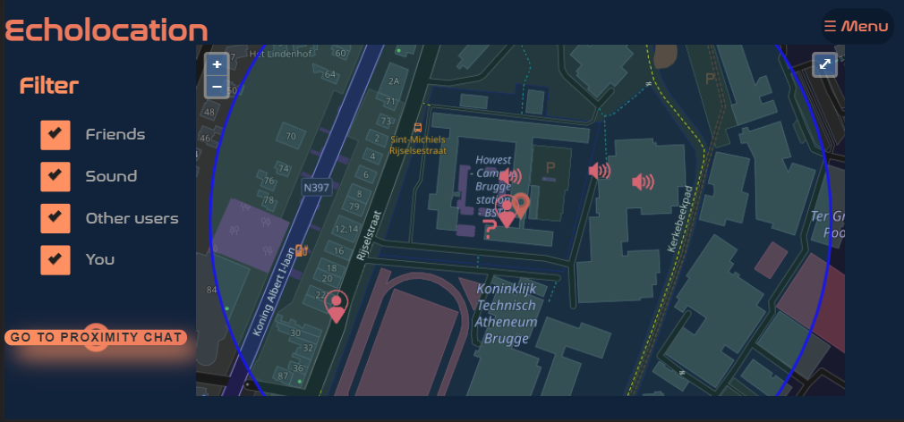
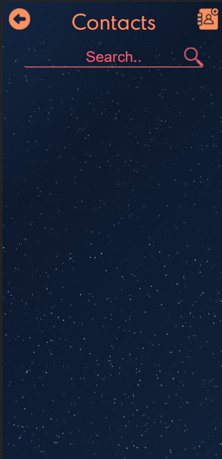
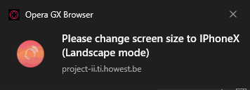

# Explanation poc
On the home page you can find the map and the filter. On the map you can see different markers, one for your friend, surrounding sounds, the other users and yourself of course. You can filter the marker by unchecking the desired marker.

You can click on the markers and then a popup will appear. Here you have different option for example, with a friend you can find the fastest way to get to him to of start a private chat with him. This can also be done with the other users. The sound has other options like muting and an overview of all the surrounding sounds.

Further, is there the option to go to a proximity chat.

On the contact page is it possible to add a contact as a friend. You will need the contact ID of the person you want to add.
After you added the person it will be possible to chat with him or to remove him.

On the settings page you see some information and the choice to update your version. When you click on update an animation will start. At the end of the animation it will say that the update was successful.

# Resolution of the poc
We choose to use the resolution of the Iphone x. If your resolution on your computer is not right a notification will appear.

