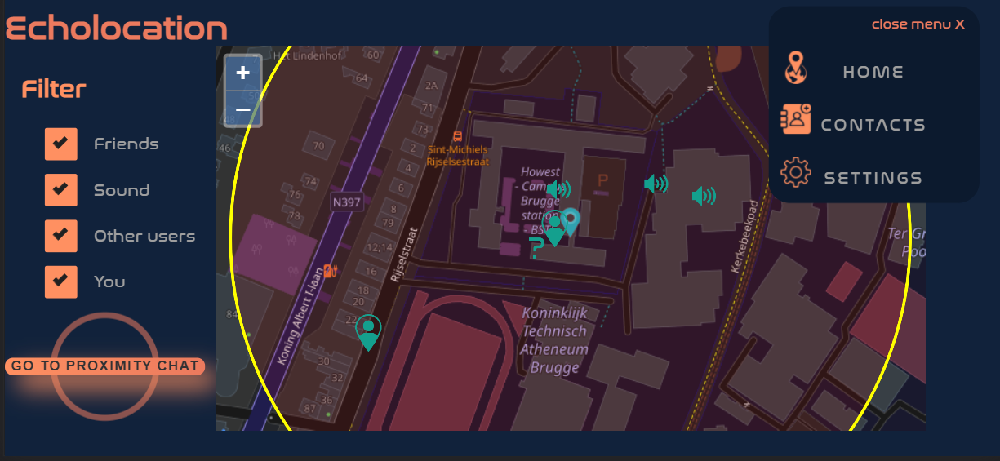
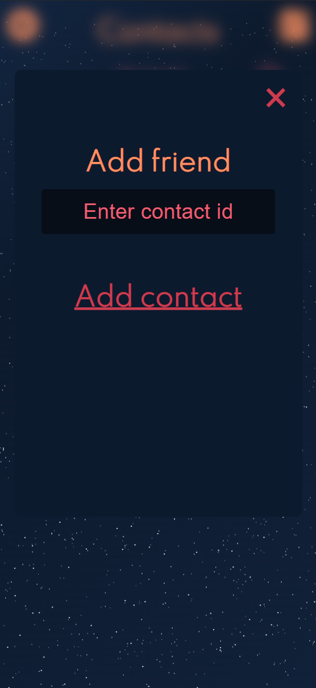
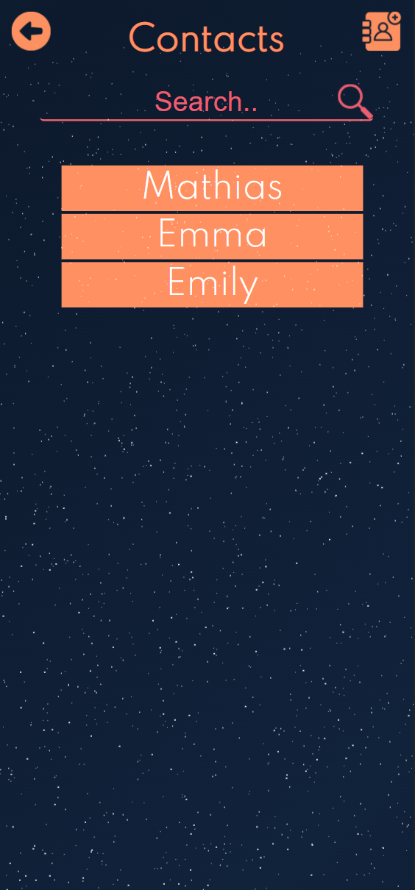

# Explanation poc

## Home page

Will start off with a picture of our home page.

On the home page you can find the map and the filter. On the map you can see different markers, one for your friend, surrounding sounds, the other users and yourself of course. You can filter the marker by unchecking the desired marker.

You can click on the markers and then a popup will appear. Here you have different option for example, with a friend you can find the fastest way to get to him to of start a private chat with him. This can also be done with the other users. 

Example of finding the fastest route to your friend.

The sound has other options like muting and an overview of all the surrounding sounds.

If you want to view all the current sounds select "See al noises" and an Overlay will appear.
Here you can mute all sounds or adjust the volume of the different sounds.

On the home page you can also find the button "Go to proximity chat" this wil open the chat were you can chat will all the people in your closes proximity.

## Menu

At the topright corner you'll find the menu option.
This allows you to navigate to the differenct pages.

## Contacts page

First of the contacts page.

On the contacts page is it possible to add a contact as a friend. 

You will need the contact ID of the person you want to add.

After you added the person you can go back and you'll see that a contact has been added.

Once you select one of the contact you can get different options:

- send chat request
- chat with your contact
- remove your contact

Underneath the different options you can recieve.

If its a new friend you'll have to send a chat request. This person will recieve a notifications.

Once your friend accepts your request you will automatically join a chat and you can start chatting!

## Settings page

Finally, there is still the settings page.

On the settings page you can find allot of information but the two most important things you will find are your own contact Id.

and the option to update your version of the software "If possible".

When you click on update an animation will start. At the end of the animation it will say that the update was successful.

# Resolution of the poc
We choose to use the resolution of the Iphone X. If your resolution on your computer is not right a notification will appear. There you can see in
what resolution you need to place it and in what orientation(landscape or portrait).

# Localy

- Open a terminal in the location you want.
- Type in the terminal 'git clone git@git.ti.howest.be:TI/2021-2022/s3/analysis-and-development-project/projects/group-17/client.git 
- This will create a a folder with all the files
- Now you can open the folder in the desired edit program.
